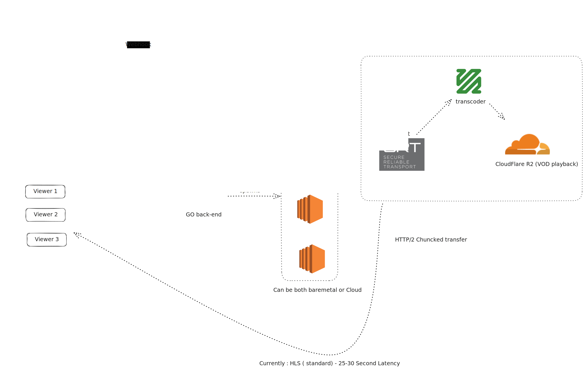

# LiveTran 📹

**LiveTran** is a self-hostable, high-performance live streaming media server written in Go. It's designed to ingest video streams via SRT (Secure Reliable Transport), transcode them in real-time to HLS (HTTP Live Streaming), and deliver them to viewers with low latency.

[](https://golang.org/)
[](LICENSE)
[](Dockerfile)

---

## ✨ Features

- **🎬 SRT Ingest:** Secure, low-latency video ingest using industry-standard SRT protocol
- **⚡ Real-time Transcoding:** On-the-fly transcoding to multi-bitrate HLS using FFmpeg for adaptive streaming
- **☁️ Cloud-Native:** Seamless integration with Cloudflare R2 for scalable, cost-effective segment storage and delivery
- **🔐 Secure by Design:** Protect your streams with JWT-based authentication and signed playback URLs
- **📈 Scalable Architecture:** Built on a modular, container-friendly architecture ready for Kubernetes deployment
- **📊 Real-time Monitoring:** Prometheus and Grafana integration for comprehensive stream health and performance analytics
- **🔍 Observability:** OpenTelemetry collector for metrics and logs, Loki for log aggregation

## 🏛️ Architecture



LiveTran follows a microservices architecture with the following components:

- **SRT Ingest Server:** Handles incoming SRT streams
- **Transcoding Engine:** FFmpeg-based real-time transcoding
- **HLS Output:** Multi-bitrate adaptive streaming
- **Cloud Storage:** Cloudflare R2 integration for segment storage
- **API Gateway:** REST API for stream management
- **Monitoring Stack:** Prometheus, Grafana, Loki, and OpenTelemetry

## 🚀 Quick Start

### Prerequisites

- [Go](https://go.dev/doc/install) (v1.24+)
- [FFmpeg](https://ffmpeg.org/download.html) (v6.0+)
- [Docker](https://docs.docker.com/get-docker/) & [Docker Compose](https://docs.docker.com/compose/install/)

### Option 1: Docker Deployment (Recommended)

1. **Clone the repository:**
   ```bash
   git clone https://github.com/vijayvenkatj/LiveTran.git
   cd LiveTran
   ```

2. **Create environment configuration:**
   ```bash
   cp .env.example .env
   # Edit .env with your Cloudflare R2 credentials and other settings
   ```

3. **Build the application:**
   ```bash
   docker build -t live-tran-server:latest .
   ```

### Option 2: Local Development

1. **Install dependencies:**
   ```bash
   go mod download
   ```

2. **Set up environment:**
   ```bash
   cp .env.example .env
   # Edit .env with your configuration
   ```

3. **Run the application:**
   ```bash
   go run cmd/main.go
   ```

The server will start on `http://localhost:8080`

## ⚙️ Configuration

### Environment Variables

Create a `.env` file in the project root with the following variables:

```bash
# Cloudflare R2 Configuration
CLOUDFLARE_ACCOUNT_ID=your_account_id
CLOUDFLARE_ACCESS_KEY_ID=your_access_key_id
CLOUDFLARE_ACCESS_KEY_SECRET=your_access_key_secret
R2_BUCKET_NAME=your_bucket_name
PUBLIC_R2_URL=https://your-bucket.your-subdomain.r2.cloudflarestorage.com

# JWT Configuration
JWT_SECRET=your_jwt_secret_key_here
ENABLE_METRICS=false

```

### Cloudflare R2 Setup

1. **Create an R2 bucket:**
   - Go to Cloudflare Dashboard → R2 Object Storage
   - Create a new bucket
   - Note the bucket name and public URL

2. **Generate API tokens:**
   - Go to Cloudflare Dashboard → My Profile → API Tokens
   - Create a custom token with R2 permissions
   - Note the Account ID, Access Key ID, and Secret Access Key

## 📡 API Usage

### Stream Management

#### Start a Stream

```bash
curl -X POST http://localhost:8080/stream/start \
  -H "Content-Type: application/json" \
  -d '{
    "stream_id": "my-live-stream",
    "webhook_urls": ["https://my-service.com/webhook"],
    "abr": true
  }'
```

**Response:**
```json
{
  "success": true,
  "data": "Stream launching!"
}
```

#### Stop a Stream

```bash
curl -X POST http://localhost:8080/stream/stop \
  -H "Content-Type: application/json" \
  -d '{
    "stream_id": "my-live-stream"
  }'
```

**Response:**
```json
{
  "success": true,
  "data": "Stream stopped!"
}
```

#### Check Stream Status

```bash
curl -X POST http://localhost:8080/stream/status \
  -H "Content-Type: application/json" \
  -d '{
    "stream_id": "my-live-stream"
  }'
```

**Response:**
```json
{
  "success": true,
  "data": "active"
}
```

### API Endpoints Reference

| Endpoint | Method | Description | Request Body |
|----------|--------|-------------|--------------|
| `/stream/start` | POST | Start a new stream | `{"stream_id": "string", "webhook_urls": ["string"], "abr": boolean}` |
| `/stream/stop` | POST | Stop an active stream | `{"stream_id": "string"}` |
| `/stream/status` | POST | Check stream status | `{"stream_id": "string"}` |

## 🎥 Streaming Workflow

### 1. Start a Stream

1. **Call the start API** with your stream ID
2. **Get SRT ingest URL** from the response
3. **Configure your streaming software** (OBS, FFmpeg, etc.)

### 2. Ingest Video

**Using FFmpeg:**
```bash
ffmpeg -re -i your_video.mp4 \
  -c:v libx264 -preset ultrafast -tune zerolatency \
  -c:a aac -b:a 128k \
  -f mpegts srt://localhost:9000?streamid=my-live-stream
```

**Using OBS Studio:**
1. Go to Settings → Stream
2. Select "Custom" as service
3. Set Server: `srt://localhost:9000`
4. Set Stream Key: `my-live-stream`

### 3. View the Stream

Once streaming, your HLS stream will be available at:
```
https://your-bucket.your-subdomain.r2.cloudflarestorage.com/my-live-stream/playlist.m3u8
```

## 📊 Monitoring & Observability

### Start Monitoring Stack

```bash
cd metrics/deployment
docker-compose up -d
```

### Access Monitoring Tools

- **Grafana Dashboard:** http://localhost:3001 (admin/admin)
- **Prometheus:** http://localhost:9090
- **Loki Logs:** http://localhost:3100

### Key Metrics

- Stream health and status
- Transcoding performance
- Network latency
- Storage usage
- Error rates and logs

## 🛠️ Development

### Project Structure

```
LiveTran/
├── api/                 # Protocol buffer definitions
├── cmd/                 # Application entry point
├── internal/            # Internal packages
│   ├── auth/           # Authentication logic
│   ├── config/         # Configuration management
│   ├── http/           # HTTP server and handlers
│   ├── ingest/         # SRT ingest and task management
│   └── upload/         # Cloud storage integration
├── metrics/            # Monitoring and observability
├── docs/               # Documentation
└── keys/               # SSL certificates and keys
```


### Logs and Debugging

```bash
# View application logs
docker logs livetran

# View monitoring logs
docker logs prometheus
docker logs grafana
docker logs loki

# Check system resources
docker stats
```

## 🤝 Contributing

We welcome contributions! Please follow these steps:

1. **Fork the repository**
2. **Create a feature branch:** `git checkout -b feature/amazing-feature`
3. **Make your changes** and add tests
4. **Commit your changes:** `git commit -m 'Add amazing feature'`
5. **Push to the branch:** `git push origin feature/amazing-feature`
6. **Open a Pull Request**

### Development Guidelines

- Follow Go coding standards and conventions
- Add tests for new functionality
- Update documentation for API changes
- Ensure all tests pass before submitting PR

## 📄 License

This project is licensed under the MIT License - see the [LICENSE](LICENSE) file for details.

## 🆘 Support

- **Issues:** [GitHub Issues](https://github.com/vijayvenkatj/LiveTran/issues)
- **Discussions:** [GitHub Discussions](https://github.com/vijayvenkatj/LiveTran/discussions)
- **Documentation:** [Wiki](https://github.com/vijayvenkatj/LiveTran/wiki)

## 🗺️ Roadmap

### Phase 1: MVP ✅
- [x] Core SRT ingest functionality
- [x] HLS transcoding and output
- [x] Cloudflare R2 integration
- [x] Basic API for stream management
- [x] Docker containerization

### Phase 2: Enhancement 🚧
- [ ] WebRTC ingest support
- [ ] LL-HLS for ultra-low latency
- [ ] Multi-region deployment
- [ ] Advanced analytics dashboard
- [ ] Kubernetes manifests

### Phase 3: Production Ready 📋
- [ ] Admin dashboard
- [ ] Advanced security features
- [ ] Auto-scaling capabilities
- [ ] Comprehensive monitoring
- [ ] Performance optimization

---

**Made with ❤️ for the streaming community**
