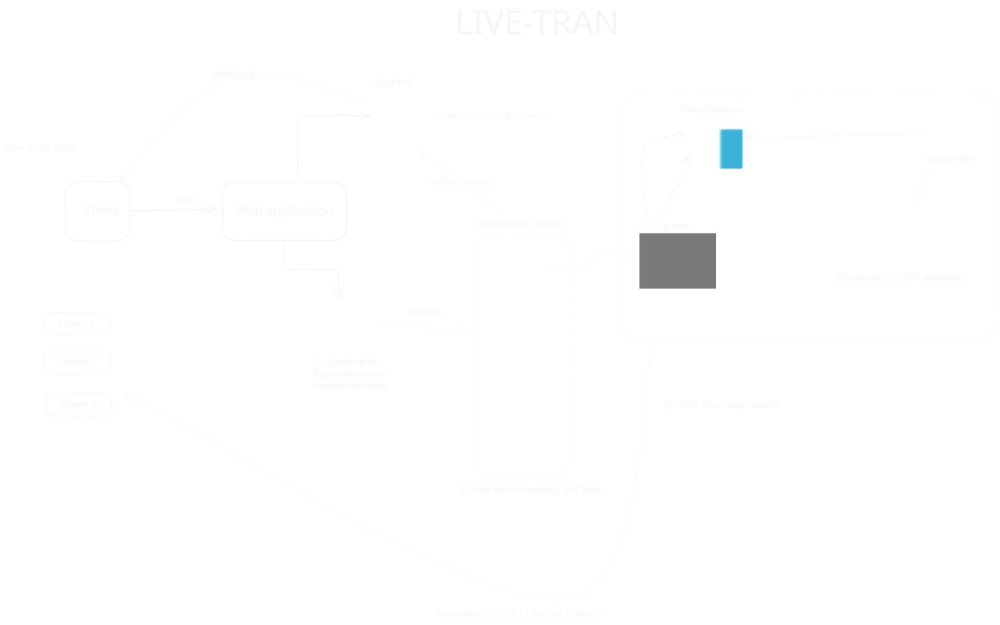

## The Big Picture

Livetran is built with a modular, event-driven architecture that ensures reliability and scalability. Each component has a specific role, working together to deliver a seamless streaming experience.

Here's a visual representation of the architecture:



## Architecture Components

### 1. API Server (`internal/http/server.go`)

The HTTP server handles all REST API requests and serves as the entry point for stream management. It runs on HTTPS (port 8080 by default) and includes:

- **Request Authentication**: HMAC-SHA256 signature verification middleware
- **CORS Support**: Enabled for cross-origin requests
- **OpenTelemetry Integration**: Optional metrics collection and export
- **Graceful Shutdown**: Handles SIGTERM/SIGINT signals cleanly

### 2. Task Manager (`internal/ingest/task_manager.go`)

The `TaskManager` is the central orchestrator that maintains the state of all active streams. It's an in-memory store that:

- Tracks stream lifecycle (INITIALISED → READY → STREAMING → STOPPED)
- Manages webhook notifications
- Coordinates SRT listener creation and cleanup
- Provides metrics data for observability

Each task includes:
- Unique `stream_id`
- Current status
- Webhook URLs for status updates
- ABR configuration flag
- Context cancellation function for graceful shutdown

### 3. SRT Ingestion (`internal/ingest/srt_task.go`)

The SRT ingestion layer handles incoming video streams:

- **Dynamic Port Allocation**: Each stream gets a unique, randomly allocated port
- **JWT Stream Key Validation**: Validates stream keys before accepting connections
- **Connection Timeout**: 120-second timeout if no encoder connects
- **Reconnection Support**: Handles encoder disconnections gracefully
- **Stream Key Format**: `mode=publish,rid={stream_id},token={jwt}`

The SRT listener uses the `go-srt` library and accepts MPEG-TS streams over SRT protocol.

### 4. FFmpeg Transcoding

FFmpeg processes the incoming SRT stream and converts it to HLS format:

**Single-Profile Mode** (default):
- Single HLS playlist with one video quality
- Output: `{stream_id}.m3u8` and `{stream_id}_XXX.ts` segments
- 4-second segments, keeps last 10 segments

**ABR Mode** (when `abr=true`):
- Three quality variants: 1080p (5Mbps), 720p (3Mbps), 480p (1.5Mbps)
- Master playlist: `{stream_id}_master.m3u8`
- Variant playlists: `{stream_id}_0.m3u8`, `{stream_id}_1.m3u8`, `{stream_id}_2.m3u8`
- Segments: `{stream_id}_{variant}_{segment}.ts`

**Encoding Settings**:
- Codec: H.264 (libx264) for video, AAC for audio
- Preset: `veryfast` for low latency
- Tune: `zerolatency` for real-time streaming
- GOP size: 60 frames (2 seconds at 30fps)
- Audio: 48kHz, 128kbps

### 5. File Watcher & R2 Uploader (`internal/upload/r2-helper.go`)

The upload system monitors the output directory and automatically uploads files to Cloudflare R2:

- **File Watching**: Uses `fsnotify` to detect new `.m3u8` and `.ts` files
- **Retry Logic**: 3 attempts with exponential backoff
- **Content-Type Detection**: Automatically sets correct MIME types
- **Public URL Generation**: Constructs public URLs from `CLOUDFLARE_PUBLIC_URL` env var
- **Callback on First Playlist**: Triggers webhook with public URL when first playlist is uploaded

## Data Flow: Step by Step

### Step 1: Start Stream Request

```
Client → POST /api/start-stream
  ↓
HMAC Signature Verification
  ↓
TaskManager.StartTask()
  ↓
Create Task with INITIALISED status
  ↓
Spawn SRT Connection Task (goroutine)
```

### Step 2: SRT Listener Setup

```
SRT Connection Task
  ↓
Allocate Free Port (random)
  ↓
Create SRT Listener on port
  ↓
Generate JWT Stream Key (2-hour expiration)
  ↓
Update Status: READY
  ↓
Send Webhook: "Stream is ready! URL -> srt://..."
```

### Step 3: Encoder Connection

```
OBS/Encoder → SRT Connection
  ↓
SRT Listener Accepts Connection
  ↓
Validate Stream Key (JWT verification)
  ↓
If valid: Accept connection
If invalid: Reject with REJ_BADSECRET
  ↓
Start FFmpeg Process (pipe input from SRT)
  ↓
Start R2 Uploader Watcher (goroutine)
```

### Step 4: Streaming & Transcoding

```
SRT Stream → FFmpeg stdin
  ↓
FFmpeg transcodes to HLS
  ↓
Writes segments to output/{stream_id}/
  ↓
File Watcher detects new files
  ↓
Upload to R2: {stream_id}/{filename}
  ↓
On first .m3u8 upload:
  - Generate public URL
  - Update Status: STREAMING
  - Send Webhook with StreamLink
```

### Step 5: Playback

```
Viewer → Requests HLS Playlist from R2
  ↓
R2 serves .m3u8 playlist
  ↓
Player requests .ts segments
  ↓
R2 serves video segments
  ↓
Player buffers and plays stream
```

## Stream States

Understanding the stream lifecycle is crucial for debugging and monitoring:

1. **INITIALISED**: Task created, SRT listener being set up
2. **READY**: SRT URL generated, waiting for encoder connection
3. **STREAMING**: Encoder connected, actively transcoding and uploading
4. **STOPPED**: Stream ended (user stop, timeout, or error)

## Error Handling

Livetran includes comprehensive error handling:

- **Port Allocation Failure**: Stream marked as STOPPED, error in webhook
- **SRT Listener Error**: Stream marked as STOPPED, cleanup initiated
- **Stream Key Generation Failure**: Stream marked as STOPPED
- **FFmpeg Process Errors**: Connection retried, stream continues if encoder reconnects
- **R2 Upload Failures**: Retried 3 times with exponential backoff
- **Connection Timeout**: After 120 seconds without encoder, stream marked as STOPPED

## Performance Considerations

- **Concurrent Streams**: Each stream runs in its own goroutine, allowing multiple simultaneous streams
- **Memory Usage**: In-memory task store; consider persistence for production
- **Disk I/O**: HLS files written locally before upload; ensure sufficient disk space
- **Network**: R2 uploads happen asynchronously; network issues don't block transcoding
- **CPU**: FFmpeg encoding is CPU-intensive; monitor CPU usage per stream

## Security Features

- **HMAC Request Signing**: All API requests must be signed
- **JWT Stream Keys**: Time-limited, stream-specific authentication
- **TLS/HTTPS**: Server requires TLS certificates
- **Stream Key Validation**: Rejects invalid or expired keys
- **Connection Isolation**: Each stream uses a unique port and key

## Next Steps

- Learn about [Authentication](/guide/authentication) for API and stream security
- Understand [Ingestion](/guide/ingestion) details for SRT connections
- Explore [Uploading](/guide/uploading) for R2 configuration
- Check [Deployment](/guide/deployment) for production setup 